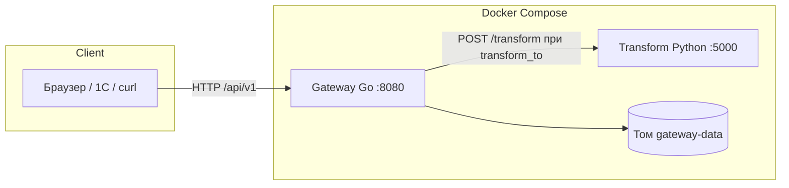
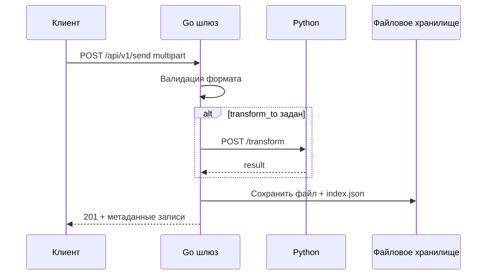
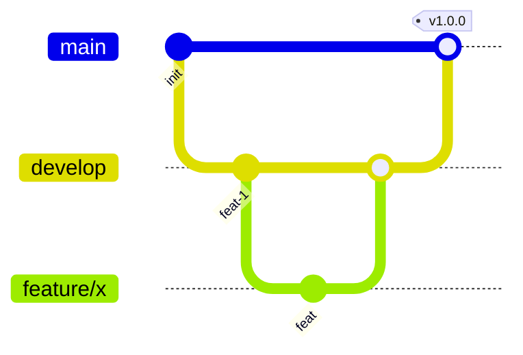

# Диаграммы

Ниже используется [Mermaid](https://mermaid.js.org/) (рендер в GitHub, VS Code с расширением Mermaid и т.п.).

## Компоненты и поток запроса

## Последовательность: отправка с преобразованием

## Git Flow (ветвление)

